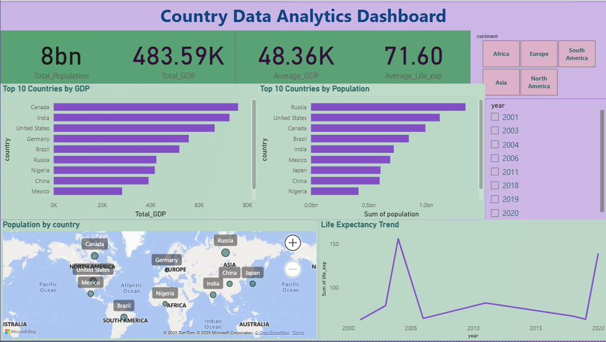

# Country Data Analytics Dashboard | Power BI
Developed an interactive Power BI dashboard to explore global country metrics including population, GDP, and area. Designed with slicers, maps, and KPI cards for dynamic insights across continents and countries.

This project presents a professional Power BI dashboard designed to analyze country-level economic and demographic indicators such as Population, GDP, and Life Expectancy across continents and years.

## Objective

To develop an interactive and insight-driven dashboard that enables users to explore global trends, compare country-level statistics, and identify development patterns over time.

## Key Metrics Visualized

- Total Population
- Total GDP
- Average GDP
- Average Life Expectancy

## Features

- Dynamic slicers for Continent and Year
- Bar charts highlighting the Top 10 Countries by Population and GDP
- Geo map visualization of GDP or Population distribution
- Line chart illustrating Life Expectancy trends over time
- Clean layout with consistent formatting and professional styling

## Dataset Fields

- Country  
- Continent  
- Population  
- GDP  
- Life Expectancy  
- Year

## Tools Used

- Power BI Desktop  
- Power Query (for data transformation)  
- DAX (for custom KPI measures)

## Dashboard Screenshot

## Business Insights Delivered

- Identify countries with the highest GDP and Population
- Analyze and compare economic and health indicators across continents
- Understand Life Expectancy trends globally and by continent
- Enable time-based filtering using Year slicer

## Author

R. Nagarjuna  
LinkedIn: https://www.linkedin.com/in/R-Nagarjuna  
GitHub: https://github.com/RAVELLANAGARJUNA

---

This project is a part of my professional Data Analytics portfolio. Feel free to explore, fork, or provide feedback.
